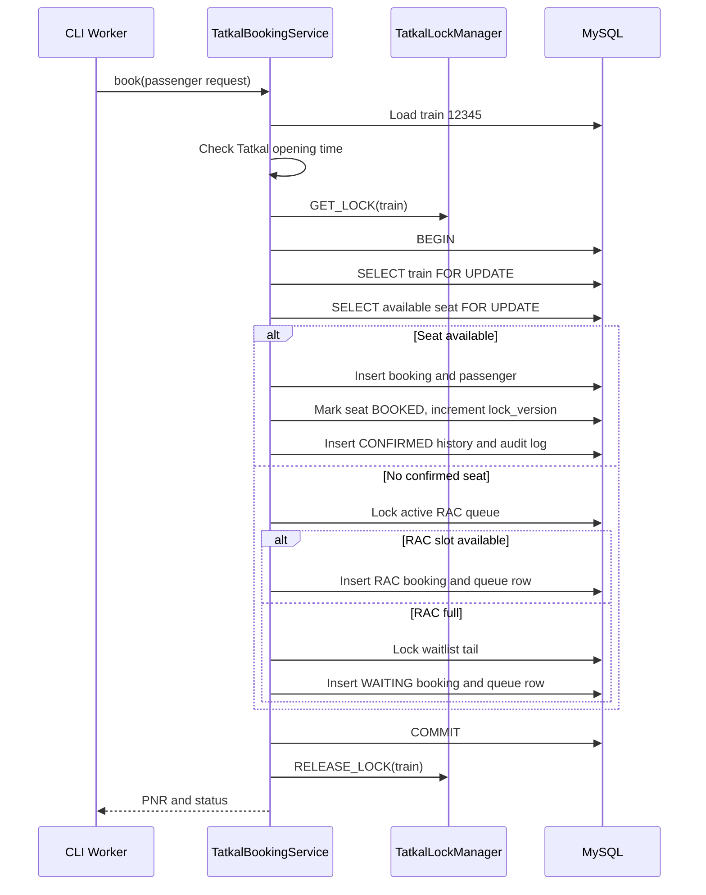
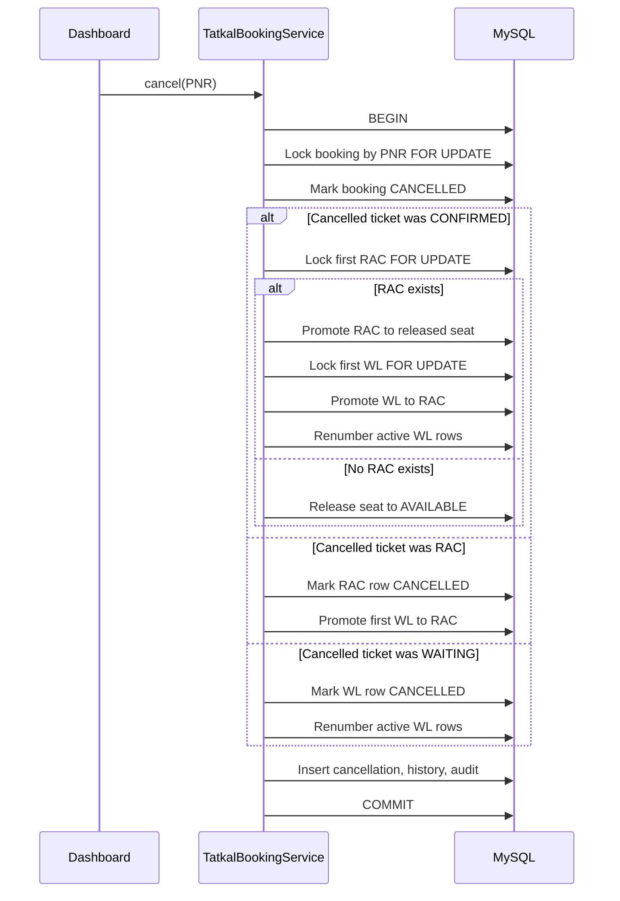

# Tatkal Ticket Booking Simulation Design

## Scope

This CodeIgniter 4 module simulates Indian Railway Tatkal booking for train `12345`.

- 20 compartments: `S1-S10`, `B1-B10`
- 72 seats per compartment
- 1,440 confirmed seats
- RAC capacity: 50
- Waitlist: unlimited
- CLI load command: `php spark tatkal:simulate 10000`

## Core Components

- Controllers: `TatkalController`
- Commands: `TatkalSimulate`, `TatkalWorker`
- Service layer: `TatkalBookingService`, `TatkalLockManager`
- Repository layer: `TatkalRepository`
- Tables: `trains`, `compartments`, `seats`, `bookings`, `passengers`, `booking_status_history`, `rac_queue`, `waiting_queue`, `cancellations`, `booking_audit_logs`

## Concurrency Strategy

The booking flow combines coarse and fine locks:

- MySQL advisory lock: `GET_LOCK('tatkal_train_12345', 10)` serializes train inventory decisions.
- Transaction boundary: every booking and cancellation runs inside one database transaction.
- Pessimistic row locks: `SELECT ... FOR UPDATE` locks train rows, available seats, RAC rows, waitlist rows, and cancellation targets.
- Optimistic version field: `seats.lock_version` increments on every allocation or release.
- Deadlock retry: retryable MySQL lock errors are retried with backoff.
- Audit log: important booking and cancellation events are stored with payload and duration.

Redis can be placed in front of `TatkalLockManager` later without changing the booking service contract. In the current XAMPP-friendly implementation, MySQL advisory locks are the reliable default.

## Booking Sequence



## Cancellation Sequence



## Running

```bash
php spark migrate
php spark db:seed TatkalSeeder
php spark tatkal:simulate 10000
```

Simulation output is stored under `writable/tatkal_simulation/<run_id>/summary.json`.

## Dashboard

- `/tatkal`: live metrics, search, reports
- `/tatkal/pnr`: PNR enquiry and cancellation
- `/tatkal/live`: JSON metrics endpoint polled by the dashboard
